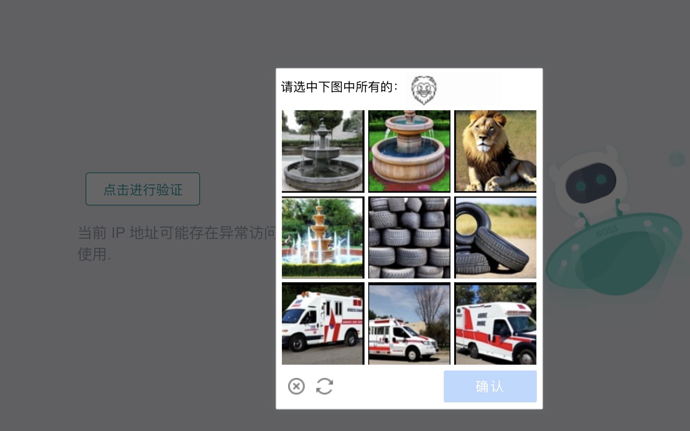

# Captcha
Captchas can be really annoying to humans, and it's even more frustrating when encountered in scraping. Of course, a website developer thinks in the opposite way. 

When a captcha appears or gets complicated and scares you, it's easy to back down on the whole project, claiming that it's an impossible mission for your programming level; or to jump down the rabbit hole, trying to find a good way and get lost in the challenge. 

But... is it okay to just live with captchas and still get the data you want?

At the beginning of a project, it's easy to say getting as much data as possible for later analyzing. However, bumping into a captcha will be a good time to think about the goal of project, the key research question, the needed data size, and find the most effective way to get the work, or some of the work, done.

## Ways to prevent

### Cookies
Many websites use cookies to track user activity and maintain sessions. Commercial websites, compared to government websites, are more likely to encourage users to log in by only providing limited information to unlogged-in users, thus resulting in less content or more frequent captchas.

To contain login information while scraping, you can find cookies from right-click on the website - inspect - application - storage - cookies. 

A cookie looks like this:
|Field|Meaning|
|--|--|
|"name": "__snaker__id"|The name of the cookie (__snaker__id). Websites use this to store unique identifiers for a session or user.|
|"value": "xxx"|The value of the cookie, which is usually a unique string assigned to the user session.|
|"domain": "www.zhipin.com"|The domain that set the cookie. This cookie is only valid when making requests to www.zhipin.com.|
|"path": "/web/user"|The path on the website where the cookie is valid. This means the cookie is only sent when accessing URLs under /web/user.|
|"expires": 1770861984|The expiration timestamp (in Unix time). This indicates when the cookie will expire and be deleted from the browser. (This timestamp corresponds to May 11, 2026).|
|"httpOnly": false|When true, the cookie is only accessible by the server (JavaScript cannot read it). Since this is false, JavaScript can access it using document.cookie.|
|"secure": false|When true, the cookie is only sent over HTTPS. Since it's false, it can be sent over HTTP as well.|
|"sameSite": "Lax"|Controls cross-site request behavior: "Lax" allows cookies to be sent on same-site requests and top-level navigation from external sites, but blocks them in most cross-site requests to improve security.|

See how to bring the cookies up to the browser in the scraping method session.

If one user account is restricted and can't hit the website very often, you can store a bunch of cookies for a bunch of accounts, and use a random one each time when scraping.

### IP proxy
Changing cookies can change login information, but the IP address still remain the same. Some websites track requests based on IP addresses, so they can flag unusual patterns and identify the scraping bots.

Using a proxy, such as rotating residential or datacenter proxies, can help distribute requests across different IPs, making them appear as if they’re coming from multiple users instead of a single automated script.

There are some proxy tools like CordCloud.

## Ways to get around

### Human Clicking

The simplest and most straightforward way to deal with captchas is to wait and manually solve them when they appear. If the scraping task is not too large or frequent, this might be an acceptable tradeoff. 

Automation tools, like Playwright or DrissionPage, allow pausing execution, letting you manually complete captchas before continuing the script. 

It's okay to have endless loop in the code:
```python
if new_tab.ele('xpath://*[text()="Click to verify"]'): # If the captcha appears
    while new_tab.ele('xpath://*[text()="Click to verify"]'): # While the captcha exists
        time.sleep(0.5) # Wait and wait, until the captcha disappears because you take action
```

And it applies to all situation no matter how fancy the captcha is.

## Ways to overcome

### Auto Clicking
If the captcha is as simple as this, with the same structure and only requires one click on the same button, you can locate the button by css selector and use Playwright or Drissionpage to automatically click it:


In this case, you don't need to monitor the screen and can go to sleep without worrying taking action every time before the captcha expires in five minutes.

### AI...?
Some AI tools might get through those fancy captchas, if you aim for very large data and really can't keep an eye on the script:

Choose from pictures:


Click the patterns in the right order:


But to be honest, I haven't tried.